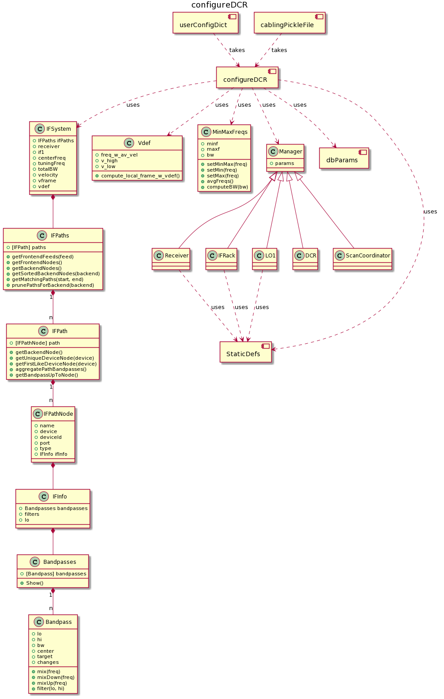

# My Config Tool

This repository represents my attempt at reproducing the results of the GBT config tool.

As of this writing it has only demonstrated configuration of most receivers for Continuum observations with the DCR (those standard configurations used with Auto procedures).


## Installation

The supported parts of this repo only require Python 3, so no installation required.

(Note: originally, graphviz and other libraries were used to represent our IF system as a graph, but it turns out this was more trouble then it was worth.)

## Unit Tests

First, you have to prepare your data, which must be extracted from the Python 2 pickle file using Python 2 into a text file that Python 3
can read.

python pkl2txtPy2.py

Then you can run the python 3 tests:

python3 configureDCRTests.py

What are the unit tests testing?  Well, in most cases, some things are being tested explicitly in each test, such as the expected paths choosen.

But how are the roughly 150 or so parameter values tested?  In the latest version of sparrow/gbt/utils are scripts for grabbing the latest values in the config tools user logs, as well as for simply grabbing all the parameter values for managers in the Scan Coordinator.  These can be saved to disk.

Basically, we saved the parameters that the config tool thought it set to this repo.  After running the steps above, the unit tests compare what parameters this repo set compared to production!

Note, if one turns on the 'debug' flag in configureDCRTests.py, lots of useful output appears, including an ASCII representation of the Bandpases in each IFPath (see Design section).  These replicate the ASCII representations of the bandpass we have gleaned from the IF Manager parameters after a configuration:

```
path:  IFPath (Rcvr1_2:XL -> DCR:A_1)
1100.00 to 1752.00 (652.00): 1400.00  change:  feed
<**************************>

1300.00 to 1450.00 (150.00): 1400.00  change:  Filter 3 (1300.000000, 1450.000000)
        <******>

2950.00 to 3100.00 (150.00): 3000.00  change:  LO lower sideband at 4400.000000
                                                                          <******>

2960.00 to 3040.00 (80.00): 3000.00  change:  IFRack,filter_select,1, (2960.000000, 3040.000000)
                                                                          <***>

path:  IFPath (Rcvr1_2:YR -> DCR:A_3)
1100.00 to 1752.00 (652.00): 1400.00  change:  feed
<**************************>

1300.00 to 1450.00 (150.00): 1400.00  change:  Filter 3 (1300.000000, 1450.000000)
        <******>

2950.00 to 3100.00 (150.00): 3000.00  change:  LO lower sideband at 4400.000000
                                                                          <******>

2960.00 to 3040.00 (80.00): 3000.00  change:  IFRack,filter_select,3, (2960.000000, 3040.000000)
                                                                          <***>
```

## Design

Currently, this code only configures the DCR for Continuum observations, so the function 'configureDCR' is our entry point.  This takes in a configuration dictionary (same that is used by the current config tool) and reads a version of the cabling pickle file generated by the original config tool.  It returns the IF paths to be used, along with the manager parameters to be set.

</img>

Here is the same UML with some color coding hinting at the provenance of some of the components and classes:

</img>

The IFSystem and IFPaths heirarchy can be confusing.  Here we try to provide some context by labeling one of our visualizations of IF Manager parameters with their corresponding class.

</img>


From a high level, here is how configureDCR() can be broken down:

   * The original user config dictionary is expanded using default values, dependent on receiver
   * The paths from the given receiver to it's given backend are found.  These are encapsulated by the generated IFPaths object.
   * Frequency information is calculated, and bandpass information stored along the paths.  All paths and higher level information stored in an IFSystem object.
   * Finally, manager paramters are calculated using the expanded configuration dictionary and generated IFSystem object, with the help of classes per manager.


### IF Paths

Paths to be used through the GBT IF system are generally represented by lists of IFPathNode lists ([[IFPathNode]]).  But we wrap these in an IFPaths and IFPath objects so that we can use associated methods with these gropus of nodes.  Each of these IFPathNode objects can identify what device they represent, and what is happening with the frequency bandpass.

All valid paths leading from a single receiver are derived first from the pickle file generated by the current config tool (a product of standard.cabling and some extra value added stuff).  Since this pickle file is generated from Python 2, we include code to convert these to text files for Python 3.

The text files are read from the path module (getIFPaths) and create [[IFPathNode]] representation.  Each of these IFPathNode objects only has information it could have obtained from the text file, which is a standard.cabling style name of a port, i.e. VEGAS:J1.  Simple string parsing is done to define this node's device and port, etc.

As the IF paths for the configuration are choosen and decisions about the frequencies along the path are made, this information is added to the IFPathNode objects, via the IFInfo, Bandpasses and Bandpass classes.

### Choosing IF Paths for the DCR

This happens in configureDCR:getDCRPaths()

The algorithm for choosing paths from a given receiver to the DCR for Continuum observations is fairly straightforward.  First, a path from the given receiver to the choosen backend is arbitraryly picked.

Note: the config tool does not seem to order the contents of the pickle file, so the arbitrary nature of this first IF path that is picked means that this code may not always pick the same path as the current config tool.  Note that here we *do* order our paths so that the first path choosen is at least deterministic.

Once this first path is choosen, the second path is choosen using the following criteria:

   * different polarization, or feed
   * different backend node
   * if IFXS node is used, make sure port (setting) is the same

That's it!

### Making frequency decisions along the paths

This happens in configureDCR:calcFreqs()

Here's where things get more complicated.  We need to understand better were some of the equations comes from for these decisions, but here's the rough outline:

   * if1 frequency are calculated. (if1 = (multiplier1 * (freqLocal - skyFreq) + ifNom))
   * NOTE: current code does NOT handle Doppler Shifts
   * receiver filter choices made.
   * LO1 mixing frequency calculated (if1 + restfreq)
   * Bandpasses set for receiver IFPathNode (filter and lo info from above)
   * IF rack filter choice made, with bandpasses for that IFPathNode updated

After this stage, we have an abstraction of how the IF system should be configured complete: we can see how signals get from the frontend to the backend and how the bandpasses change along the way.

When investigating how the config tool works, visualizations were made of the IF system based off the IF Manager parameters, which were set via the manager parameters the config tool set.  In our repo, we have recreated those visualizations, but from first principles, *before* the manager parameters are set.

If our repository could set the manager parameters whose values it finds, we should be able to recreate our original visualizations, and they should match or IF system abstraction!

### Setting Manager Parameters

A series of classes is used to help convert our value-added config dictionary and IFSystem object into the actual values for various M&C Manager parameters.

Some of these classes were borrowed from the original config tool and hacked for our circumstances, while others we created since the context was much simpler.  

A heavy relience is made on StaticDefs.py, which stores a lot of hard coded information, mostly keyed off of receiver.  This has been copied directly from the original config tool.


## Status

We currently have 7 unit tests passing.  The unit tests do not raise an error if this repo sets a manager-parameter that the config tool does not, or vice versa.  It only raises an error if a shared manager-parameter has different values.

For 5 of our 7 tests, we are setting all of the about 150 parameters identically to config tool, except for less then 10!  For receivers Rcvr26_40 and Rcvr12_18, there are an additional 20-30 parameters we still need to set.

The arrayed receivers, KPFA and Argus, we are not configuring: they take a radically different approach that we need to study further.

## Know Issues

What to do next?  Well, first, let's review the shortcomings of the current code, in order of descending seriousness:

   * Only configures one backend (DCR)
   * Does not handle doppler tracking (LO1 velocity is always zero)
   * Does not handle arrayed receivers (KPFA, ARGUS)
   * Does not get manager parameters 100% (90% for most, 70% for some)
   * Does not actually send parameters to managers (so can't test on real system)
   * Unit Tests are really high level regression tests.  There are no tests at a lower, component level.

## Next Steps

This code explicity avoids recreating the functionality of the IF collapsing algorithm, which is key to configuring vegas, and perhaps the arrayed receivers as well.  This, along with the doppler tracking, is probably the biggest config tool nut to crack.  So do we refine this current DCR configuration functionality, or do we move on to solve more general problems?   


